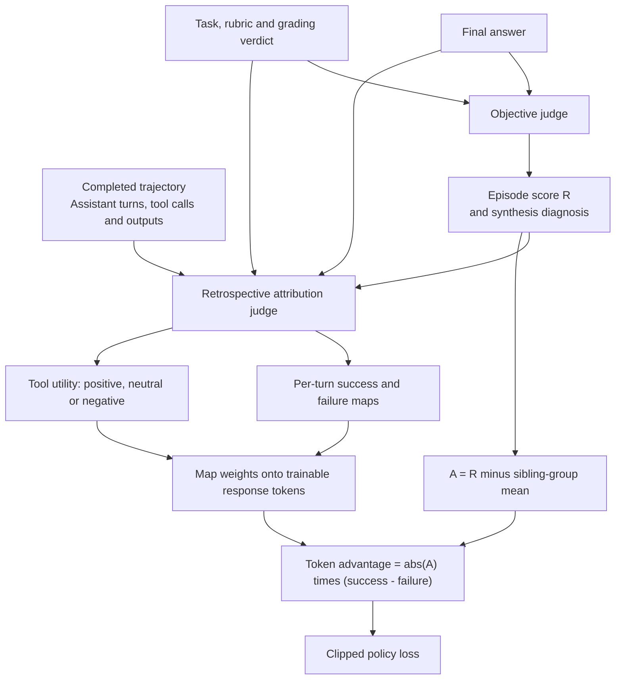

# Retrospective Turn-Level Credit Assignment

An implementation of outcome-informed, turn-level credit assignment for agent training.
The judge sees a completed trajectory. The policy receives different training
weights on the tokens belonging to different turns.

## What the judge sees

There are two judge stages:

1. **Objective scoring:** the task, grading rubric, final answer, authoritative
   grading verdict, and objective context produce an episode score and synthesis
   diagnosis.
2. **Retrospective attribution:** the same inputs, the objective score and
   diagnosis, and all supplied assistant turns, tool calls, and following tool
   outputs produce sparse success, failure, and tool-utility maps.

The attribution call is made after the rollout finishes, not independently after
each action. It can connect an early evidence search with the final synthesis.
These are judge-assigned attributions; the implementation does not run
counterfactual rollouts with individual turns removed.



## Credit assignment

For ordinary scored trajectories, the group contrast is:

```text
A_i = R_i - mean(R_j for sibling rollouts of the same task)
token_advantage[i, k] = abs(A_i) * (success[i, k] - lambda * failure[i, k])
```

The default negative scale `lambda` is 1.0. The episode contrast sets the magnitude;
the success and failure maps set the sign and location. A useful turn in a
low-scoring rollout can therefore receive positive advantage. A harmful turn in a
high-scoring rollout can receive negative advantage.

- Success and failure coefficients are bounded in `[0, 1]`.
- Omitted turns have zero weight; missing maps do not become uniform weights.
- A turn coefficient is copied to its eligible tokens, not divided by turn length.
- Masked tokens have zero advantage. Loss reduction is performed by the trainer.
- Reasoning attribution and tool utility are aggregated independently. Their
  positive maps are combined with an elementwise maximum, as are their negative
  maps; they are not added together.
- Tool utility excludes turns that write the final report. Report-writing turns
  can still receive reasoning credit or blame for what they actually conclude.

The prompt distinguishes useful exploration from mistakes: a reasonable search
that finds no match is neutral, a verification that fixes a real defect can earn
credit, and demonstrably redundant calls can receive negative tool utility.
Sound evidence gathering is not blamed merely because later synthesis fails.

## Run the offline example

Python 3.11 or newer is sufficient. No API key, GPU, or third-party dependency is
needed for the example or unit tests.

```bash
python3 -m examples.offline_demo
python3 -m unittest discover -s tests -v
```

The example uses synthetic turns and explicitly supplied attribution weights.
It calls the actual token-map builder and group-centering function; it does not
call a judge or present synthetic scores as experimental measurements.

## Files

| File | Role |
| --- | --- |
| [`turn_credit_synthesis_spans.py`](trata_slime_muse/turn_credit_synthesis_spans.py) | Judge prompts, request construction, parsing, retries, map construction, group centering |
| [`turn_credit_native.py`](trata_slime_muse/turn_credit_native.py) | Native Slime/Megatron token-advantage hook |
| [`objective.md`](prompts/objective.md) | Exact exported objective system prompt |
| [`attribution.md`](prompts/attribution.md) | Exact exported attribution system prompt |
| [`offline_demo.py`](examples/offline_demo.py) | Synthetic turn-to-token example |
| [`SOURCE_MANIFEST.json`](SOURCE_MANIFEST.json) | SHA-256 hashes of the included source modules |

The two source modules are copied unchanged from the local training source
snapshot. This repository isolates the credit-assignment component, not the full
training system or evaluation datasets.

## Training integration

`assign_turn_credit(...)` accepts an already-completed rollout and returns success
weights, failure weights, the objective score, and diagnostic metadata. Its
`TurnSpan` objects must use response-token offsets from the actual rollout
tokenization. The caller supplies the loss mask, including wrapper/tool-output
masking; this package does not infer that mask from text.

`post_process_anchored_objective_rewards(...)` computes within-task centered
rewards. `apply_native_turn_credit(...)` replaces uniform token advantages with
the signed maps and respects context-parallel slicing and loss masks.

The native hook requires the existing Slime/Megatron/PyTorch training runtime.
The judge transport additionally requires `aiohttp` and an `OPENROUTER_API_KEY`.
Configuration is read by `TurnCreditConfig.from_environment()`; importing the
modules or running the offline example never sends an API request. The generic
configuration defaults in this snapshot are not a complete experiment manifest.

The snapshot also contains a separate `apply_calibrated_turn_credit` hook. The
native hook and formula documented above are the entry point demonstrated here.
